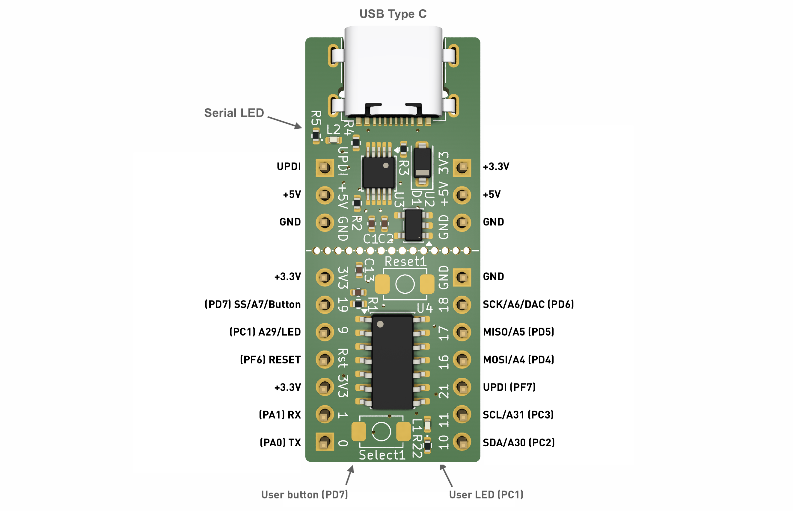

# AVRxxDD14
Tiny breadboard compatible development board based on either AVR64DD14, AVR32DD14 or AVR16DD14 - depending on your need for Flash memory. This repo contains the complete Kicad design files under an MIT license as well as documentation, pinout & images of the verified design. I'm a consultant based in Oslo/Norway, so [get in touch](https://maketronics.no/about/) if you need custom hardware based on AVRxxDD or [other MCUs](https://flashgamer.com/blog/comments/microcontroller-reference-boards).

The numbers on the PCB are the Arduino pin numbers as used in DxCore. The numbers in parentheses are the pin names used in the [official documentation from Microchip](http://ww1.microchip.com/downloads/en/DeviceDoc/40001912A.pdf). DxCore has these mapped so that PA5 is PIN_PA5 in Arduino code.

*Note that there's currently no PCB files in this repo, as I always verify my designs before publishing them. You'll find PCB files / pictures of the final PCB here once I receive and test them.*

## Features
This nifty little microcontroller paired with the CH340 serial chip, makes for a very compact development board. Due to it's tiny size, you have 3 rows on each side of the breadboard to connect jumper wires to. When used with Spence Konde's brilliant [DxCore](https://github.com/SpenceKonde/DxCore), this is very smooth to use for prototyping.

The board has a builtin LED on (PC1) and a button (PD7) for testing. The Serial chip has a LED on the TX line, so you can visually inspect when programming is done and finished. My primary reason for looking at this chip series was the 10-bit DAC output on PA6. Very few MCU's in this price range has a builtin DAC, so it is very handy for many types projects such as controlling devices based on voltage. One such example is controlling 0-10V motors/fans by just adding a small OpAmp circuit.

Some things to note:

### 2-in-one
The UPDI programmer can be cut away, so you can use the MCU and programmer separately. In that case, the MCU must be powered separately, since the 3.3V regulator sits on the UPDI Programmer.

### Drawbacks
One drawback is that the setup does not allow for direct Serial debugging. You have to connect a separate Serial Converter/Adapter ([like this one](https://www.taydaelectronics.com/cp2102-serial-converter-usb-2-0-to-ttl-uart-ftdi.html) or anything similar) to use Arduino's Serial.

While this chip is great in many ways, you might also be interested in the [design I've made for the older ATTiny1-series](https://github.com/jenschr/ATTinyX14-development-board). They are simpler, but also cheaper. They offer one more pin and a more logical pinout when used with megaTinyCore.